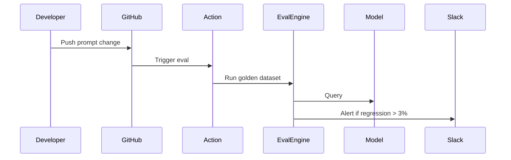

# Architecture: Model Regression Detection System
> Maturity: Full Prototype

## System Diagram
The following Mermaid.js sequence diagram maps the core workflow and interactions:

## Component Breakdown
- **Core Technology**: Python, RAGAS, DeepEval, SQLite
- **Design Paradigm**: Emphasizes high availability, fault tolerance, and security.
